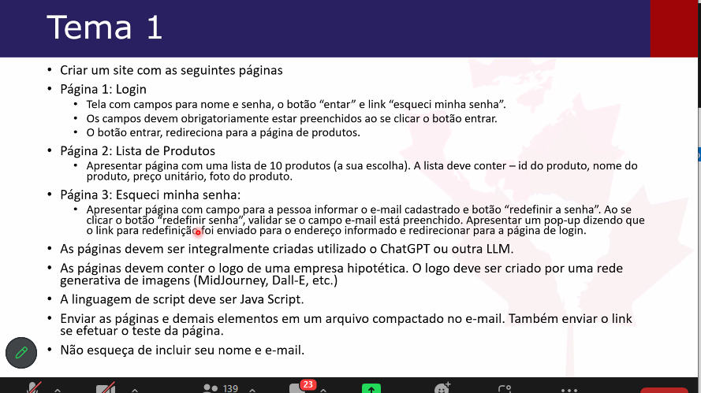

# Desafio 1 - I2A2
### Primeiro desafio para o curso de redes generativas do I2A2 - Institut d'Intelligence Artificielle Appliquée. 
  

>A proposta foi fazer um site de vendas utilizando integralmente ferramentas de inteligência artificial, a saber alguma rede generativa e alguma IA geradora de imagens.

Instruções do projeto
--
  

Resultado
--
 Optei por fazer um site de vendas para uma livraria especializada em livros de horror.

Os resultados desse projeto podem ser vistos clicando no seguinte link: [The Horror Bookstore](https://the-horror-bookstore.onrender.com/ "Link para o site")
> Para acessar o site basta utilizar qualquer e-mail e senha fictícios.

   

Tecnologias usadas
--
Utilizei o [ChatGPT](https://chat.openai.com/ "Link para o ChatGPT") como guia para a construção do site e o [Leonardo.ai](https://leonardo.ai/ "Link para o Leonardo.ai") para geração das imagens dos produtos do site. 

Foram utilizadas como linguagens de construção do site:  

  

Para hospedagem do site:  

Guia dos arquivos do projeto
--
- As versões iniciais do site, obtidas nos primeiros contatos e prompts com o ChatGPT, podem ser encontradas em  [01. versões iniciais do site](https://github.com/paularml/desafio1-i2a2/tree/main/01.%20vers%C3%B5es%20iniciais%20do%20site "Link para o arquivo versões iniciais").

- As inspirações para o site podem ser encontradas em [02. inspirações](https://github.com/paularml/desafio1-i2a2/tree/main/02.%20inspira%C3%A7%C3%B5es "Link para as inspirações do site"). Utilizei como inspiração central o anime japonês JigokU Shoujo e seu site [Jigoku Tsushin](https://www.jigokutsushin.it/ "Link para as Jigoku Tsushin"). Bem como os mangás de terror de Junji Ito.

- Há uma lista de itens não usados no site, mas que serviram de base e/ou inspiração: [03. intens não usados](https://github.com/paularml/desafio1-i2a2/tree/main/03.%20intens%20n%C3%A3o%20usados "Link para itens não usados") 

- Há uma lista de produtos não utilizados que foram gerados pelo Leonardo.ai, se encontra em [04. produtos não usados](https://github.com/paularml/desafio1-i2a2/tree/main/04.%20produtos%20n%C3%A3o%20usados "Link para produtos não usados").

- As imagens utilzadas no site se encontram em [imagens usadas](https://github.com/paularml/desafio1-i2a2/tree/main/imagens%20usadas "Link para imagens usados").

- Os arquivos centrais do site (HTML, CSS e Javascript) encontram-se em [src](https://github.com/paularml/desafio1-i2a2/tree/main/src "Link para src").

- As conversas completas com o ChatGpt encontram-se em [00. conversa com o chatgpt.txt](https://github.com/paularml/desafio1-i2a2/blob/main/00.%20conversa%20com%20o%20chatgpt.txt "Link para conversas").

